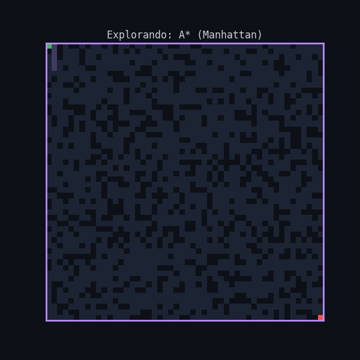

# 🚀 Maze Navigator: Comparativa de Algoritmos de Búsqueda


Este proyecto es un simulador de navegación en cuadrículas que permite visualizar y comparar la eficiencia de diferentes algoritmos de Inteligencia Artificial para la resolución de laberintos. El sistema genera entornos aleatorios y evalúa cómo distintas estrategias de búsqueda encuentran el camino óptimo entre dos puntos.

---

## 📺 Demostración
Aquí puedes observar al algoritmo **A* (A-Estrella)** utilizando la heurística de Manhattan para encontrar la ruta más eficiente en tiempo real:


---

## 🧠 Algoritmos Implementados

El simulador permite comparar cuatro enfoques clásicos de búsqueda en grafos:

*   **BFS (Breadth-First Search):** Garantiza el camino más corto en grafos sin pesos, pero explora una gran cantidad de nodos (búsqueda exhaustiva).
*   **DFS (Depth-First Search):** Explora profundamente una rama antes de retroceder. No garantiza el camino más corto y suele ser ineficiente en laberintos.
*   **A* (Manhattan):** Búsqueda informada que utiliza la distancia en cuadrícula. Es extremadamente eficiente para movimientos en 4 direcciones.
*   **A* (Euclidiana):** Utiliza la distancia en línea recta. Útil para comparar cómo una heurística "optimista" afecta la expansión de nodos.

---

## 📊 Visualización y Análisis

El proyecto no solo resuelve el laberinto, sino que genera herramientas de diagnóstico:

1.  **Mapas de Exploración:** Diferencia visual entre la "ruta final" y los "nodos inspeccionados" (frontera).
2.  **Gráficas de Rendimiento:** Comparativas de tiempo de ejecución (ms), memoria utilizada (nodos en frontera) y longitud de los caminos.
3.  **Generación de Animaciones:** Exportación automática en formato GIF para presentaciones o documentación.

---

## 🛠️ Instalación y Uso

### Requisitos Previos
Asegúrate de tener Python 3.10 o superior instalado.

### 1. Clonar el repositorio
```bash
git clone https://github.com/tu-usuario/maze-navigator.git
```

### 2. Instalar dependencias
```
pip install -r requirements.txt
```

### 3. Ejecutar el simulador
```
python main.py
```

## ⚙️ Estructura del Proyecto
**laberinto.py:** Lógica de generación de la cuadrícula, obstáculos y manejo de nodos.

**buscadores.py:** Implementación de los algoritmos de búsqueda.

**visualizador.py:** Motor gráfico basado en Matplotlib para imágenes y animaciones.

**main.py:** Punto de entrada para configurar experimentos y tamaños.

## ✒️ Autor
* Pablo Sumba - PabloSumbaU
* pablosumba5@gmail.com